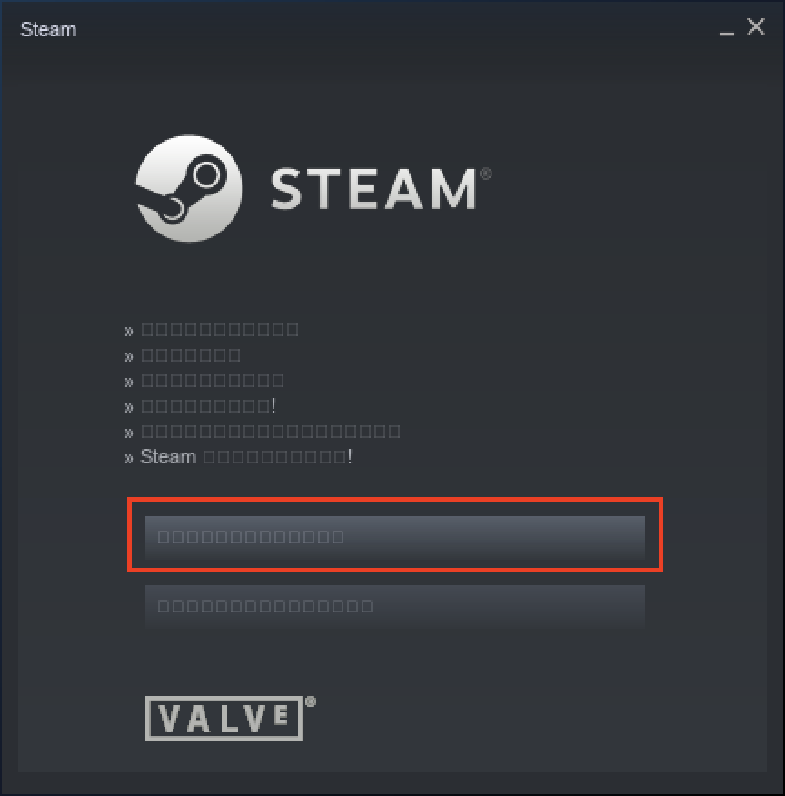

# なにこれ

macOSでWindows仮想環境を入れずにHeart of Crownをやる記事です。
普通にWindows仮想環境を入れたり、Windowsマシンのある人は対象外です。

# 基本方針

SteamでHeart of Crownを購入、WineでSteamを入れて、豆腐地帯を通り抜けて動かします。
前提としてHomebrewの導入は終わっているものとします。

**macOS Catalinaはwine非対応なので上げてしまった人は諦めてください**

# Heart of Crownの購入

SteamでHeart of Crown PCを購入します。Steamアカウントを持っていない場合はここで作成しておきます。
大体の人が持っているので、Northern Enchantress(北限パック)はセットで購入しておいたほうがいいです。

[Steam：Heart of Crown PC](https://store.steampowered.com/app/476420/Heart_of_Crown_PC/?l=japanese)

# Wine & XQuartz インストール

以下のコマンドでWineを入れる。

`$ brew cask install xquartz wine-stable`

# Steamのインストール

[Steam - 究極のオンラインゲーミングプラットフォーム](https://store.steampowered.com/about/)へ行き、Windows版をダウンロード

以下のコマンドを打ってセットアップ。このウィザードでは通常通り日本語が表示されるため、そのまま完了し、Steamを立ち上げてしまって問題ないです。

`$ wine ~/Downloads/SteamSteup.exe`

# Steamのセットアップ

ここからHeart of Crownのダウンロードと実行まで全部豆腐地帯なのでスクリーンショットにしたがって操作すると突破できます。

赤枠で囲んだボタンをクリックして発行済Steamアカウントを利用するログイン画面へ行きます。

パスワードとユーザー名を入力し明るくなっている左のボタンをクリックします

ワンタイムパスワードを受け取るため、上を選んだ状態で 豆腐2つと`>`のボタンをクリックします。

ワンタイムパスワードをメールからコピーしたら入力ボックスを右クリックして3つめのメニューが「貼り付け」です。
貼り付けたら、右下をクリックしてログイン完了です。

右下をクリックするとSteamが立ち上がります。

既にHeart of Crownが購入済みの場合はあるのでインストールボタンをクリックします。

インストールボタンをクリックすると今度はHeart of Crownのインストールウィザードが立ち上がるので豆腐2つと`>`を押して待機すれば入ります。

待機の様子です。

インストールが完了すると立ち上げ可能になるので立ち上げます。

これが最後の関門です。上がHeart of Crown本体っぽいので上を選ぶと起動します。

起動しました。ネットワークが使えるかは後ほど検証します。

